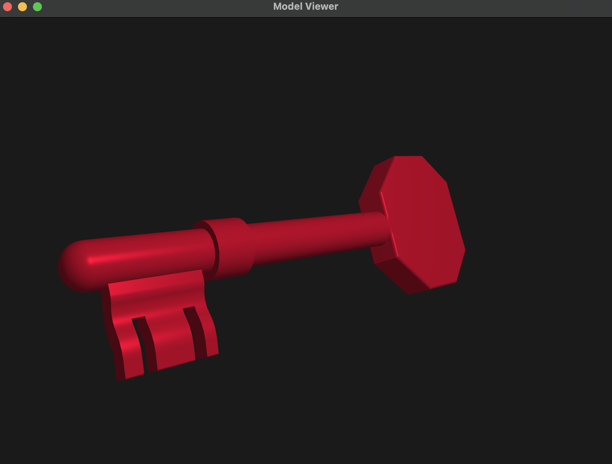
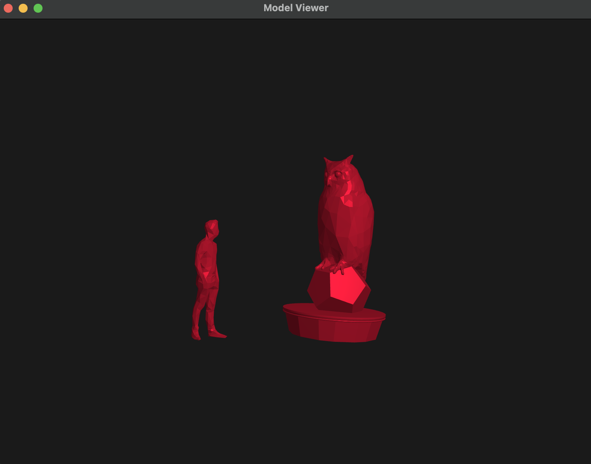
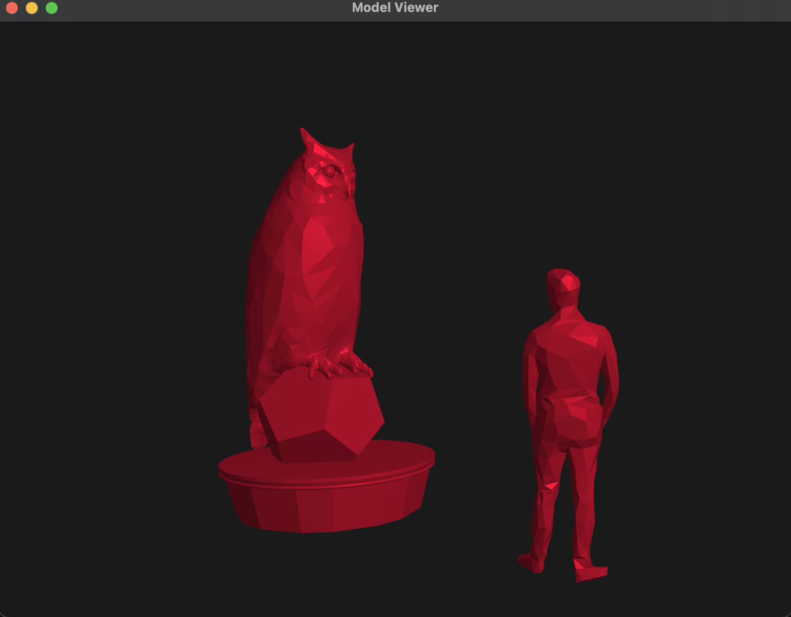
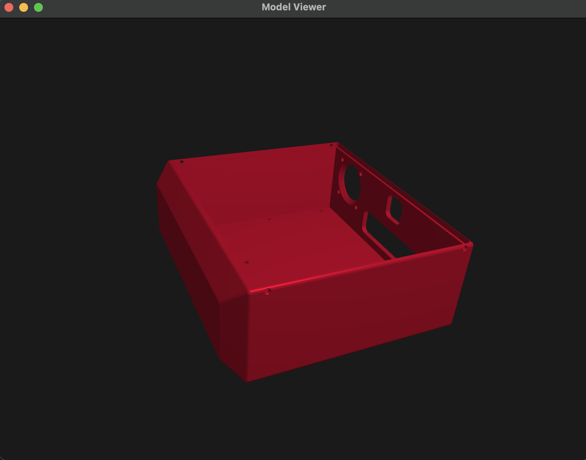
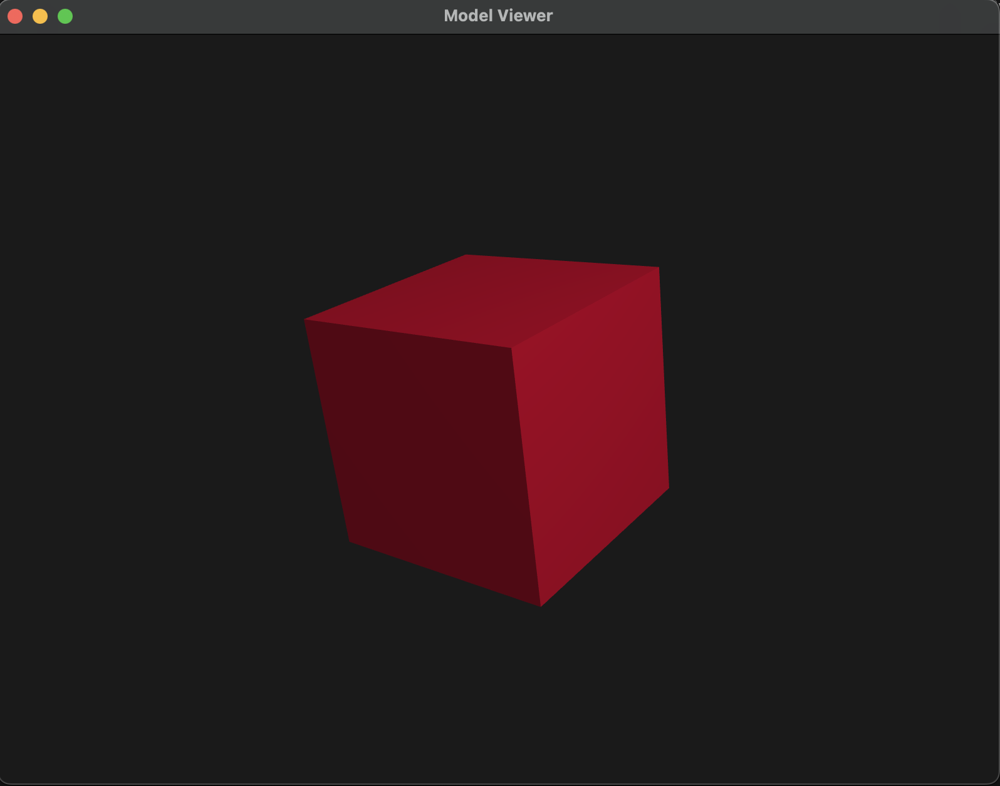

# OBJ Model Viewer

OBJ Model Viewer is a **cross-platform**, **interactive**, **GPU-accelerated** 3D model viewer built to visualize and interact with `.obj` files. It leverages OpenGL for rendering, GLFW for window and input handling, and cGLM for matrix and vector operations.



---

## Features

- Load and render `.obj` files, including vertex and normal data.
- Real-time lighting and shading to enhance visual depth.
- Interactive controls for **rotation** (using quaternion mathematics) and **zoom** via scaling.
- Hardware-accelerated rendering for smooth and responsive performance.

---

## Usage

OBJ Model Viewer provides a lightweight tool for designers and engineers who need a fast and efficient way to preview `.obj` models. It's especially useful for:

- Demonstrating 3D assets to clients in an intuitive and responsive UI.
- Lightweight inspection of geometry without loading full-scale design tools.

---










---

## Installation

### Prerequisites

Make sure you have the following installed:

- [CMake](https://cmake.org/download/) (version 3.10 or newer)
- A C++ compiler with C++17 support
- OpenGL (usually included with graphics drivers)

> GLFW and cGLM are automatically downloaded and built using CMake's `FetchContent`.

### Build Instructions

```bash
git clone https://github.com/Jasraj-Kalar/OBJ-Model-Viewer.git
cd OBJ-Model-Viewer
mkdir build
cd build
cmake ..
make
```
### Running Instructions
```
./bin/ModelViewer <OBJ File Name>
```

---

# Limitations

The model viewer is limited to .obj files which use triangular mesh types only.
